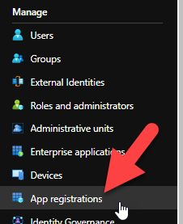

# AzureAD/365 Graph Permissions

Your first ImmyBot tenant will be automatically linked to the Azure tenant that you signed up for ImmyBot with. You can link other ImmyBot tenants to Azure from the tenant Azure tab.

## Linking to an Azure Tenant

After creating an ImmyBot tenant, link it to an Azure tenant by navigating to the Azure tab in ImmyBot and entering the Azure tenant's principal id or domain and clicking `Save`.

## Azure Permission Level

Once your ImmyBot tenant has been linked to Azure, you can set the **Azure Permission Level** from the tenant Azure tab. This allows ImmyBot to:

1. Sync all users from the Azure tenant
2. Sync all users from your GDAP customers **(please see [GDAP Customers](#gdap-customers))**
3. Install the 365 applications a user is licensed for
   - Apps for business/Apps for entrprise/Project/Visio
4. Deploy software to Teams, On-Premises Security Groups
   - Ex. Everyone in the Engineering Team gets AutoCAD 2022

The **Azure Permission Level** has two modes: _Default_ and _Custom_

**NB: In both the _Default_ and _Custom_ modes, consent must be provided for each customer you want to sync. Please see [GDAP Customers](#gdap-customers) for requirements**

### Default

In this mode, you don't need to create an app registration. You consent as an administrator, allowing ImmyBot access users in your tenant and your customers tenants. **Please see [GDAP Customers](#gdap-customers) if you want ImmyBot to access your customers' users**.

### Custom

In this mode, you create an App Registration and provide its Application (client) Id and Secret to ImmyBot, allowing you to customize the permissions Immy has to you and your customer's environments.

#### Create an App Registration

Navigate to: <https://aad.portal.azure.com/>

**Important!** Your app registration must have a Web redirect uri of `https://<your-domain>.immy.bot/consent-callback`, replacing `<your-domain>` appropriately

#### Grant Permissions

See the screenshots below for the minimum permissions.

#### Create Client Secret

**Please see [GDAP Customers](#gdap-customers) if you want ImmyBot to access your customers' data**.

#### Copy the `Application (client) ID` and `Client Secret Value` into the form in ImmyBot.

## GDAP Customers

To sync users from GDAP customers of your Azure Partner, permission must be granted in the customer
tenants to Immy's app registration (_Default_ or _Custom_). This can be achieved either by clicking
on the `Consent` button for each customer individually ("Manual consent") or by using the
Pre-consent button ("Pre-consent").

### Manual Consent

This can be done by clicking on the `Consent` or `Reconsent` button for the customer on either the
Azure Settings page or ont he Azure tab of the ImmyBot tenat linked to the customer.

**NB: When manually consenting to an Azure customer, you must authenticate using an administrator account from that customer!**

### Pre-Consent

Immy can automatically grant consent to your GDAP customers using the Partner Center API, removing
the need to consent to each customer individually. To do this, you must authenticate to the Partner
Center API with a user in the partner tenant that meets these requirements:
1. Is a member of the `AdminAgents` security group
2. Is given the `Application administrator` and `Privileged role administrator` Entra roles at the customer through the GDAP relationship

#### Example: GDAP Role Assignments

Here is an example GDAP relationship configuration that will work with Immy's pre-consent functionality:

1. Create security group in the partner tenant named `Application Administrators`
2. Create security group in the partner tenant named `Privileged Role Administrators`
3. Assign the `Application administrator` Entra role to the `Application Administrators` security group on the customer's admin relationship
4. Assign the `Privileged role administrator` Entra role to the `Privileged Role Administrators` security group on the customer's admin relationship
5. Add the partner user that you wish to sign-in to the Partner Center API with to  `AdminAgents`, `Application Administrators` and `Privileged Role Administrators` security groups

For more information, see these Azure docs:
- [Obtain permissions to manage customer](https://learn.microsoft.com/en-us/partner-center/gdap-obtain-admin-permissions-to-manage-customer)
- [Assign Microsoft Entra roles](https://learn.microsoft.com/en-us/partner-center/gdap-assign-microsoft-entra-roles)

## Common Issues

### Consent

#### AADSTS500113: No reply address is registered for the application

This error occurs when the redirect uri is not set correctly on the custom app registration.
Please follow these steps to set the redirect uri correctly:

1. Navigate to the [Azure Portal](https://portal.azure.com)
1. Navigate to the [Microsoft Entra ID blade](https://portal.azure.com/#view/Microsoft_AAD_IAM/ActiveDirectoryMenuBlade/~/Overview)
1. Navigate to the [App Registrations blade](https://portal.azure.com/#view/Microsoft_AAD_RegisteredApps/ApplicationsListBlade)
1. Select the app registration you created for ImmyBot
   - You may need to change the filter to "All Applications"
   - You can paste the Application (client) ID of your custom app registration into the search box to find it
   
1. Navigate to the Authentication blade
   - Select "Add a platform"
   - Select "Web" as the type
   
   - Enter `https://<your-domain>.immy.bot/consent-callback` as the redirect uri, replacing `<your-domain>` appropriately
   - Click "Configure"
   

