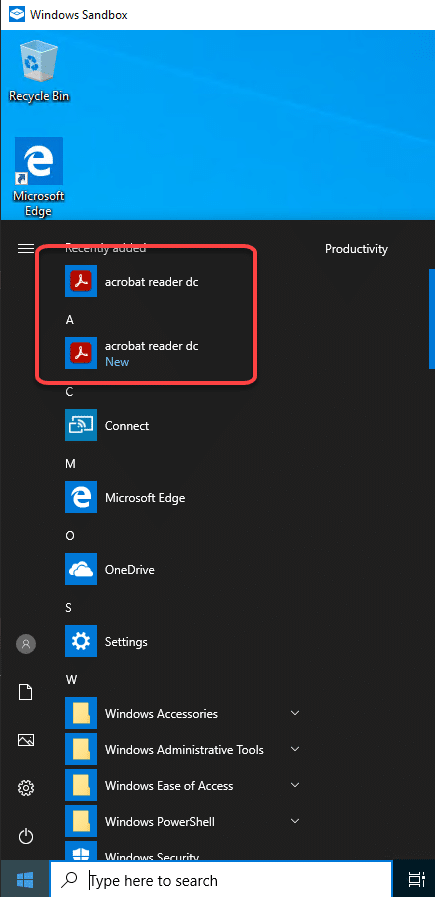
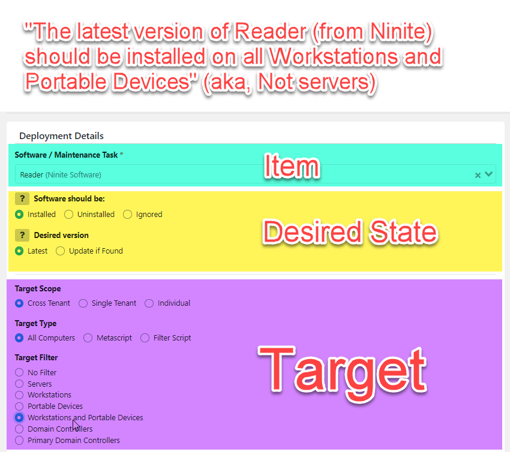
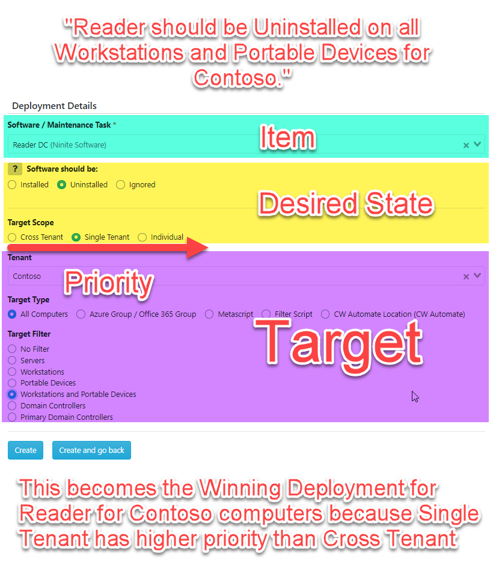
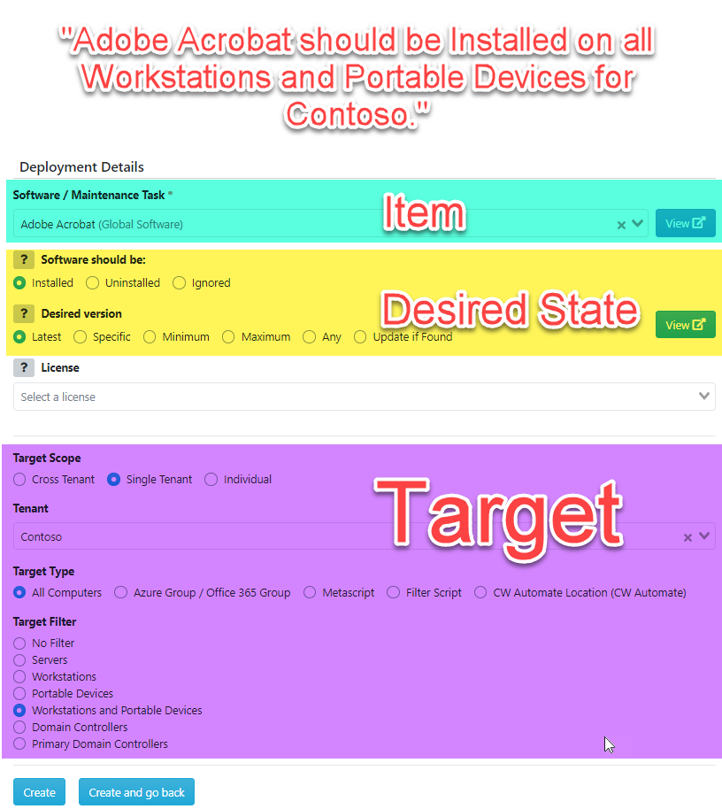
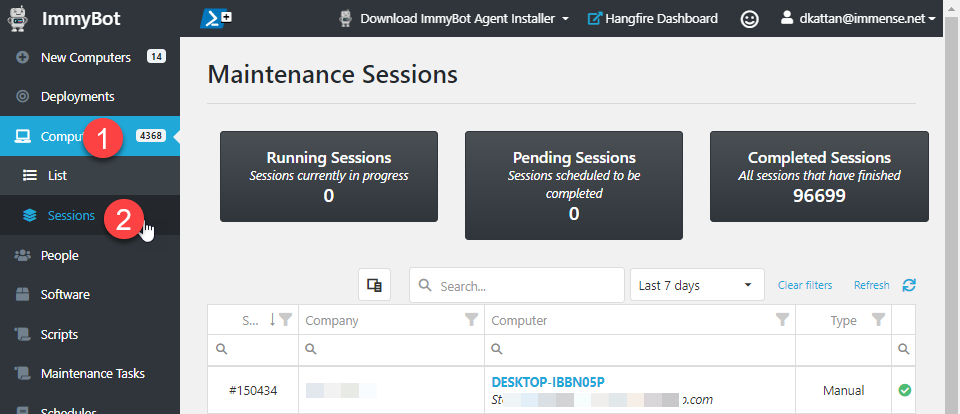
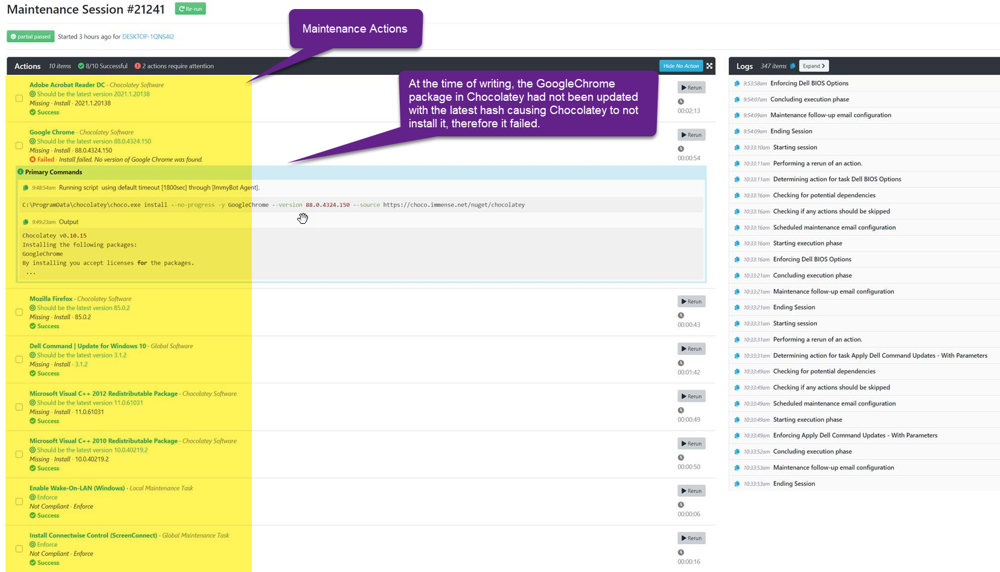
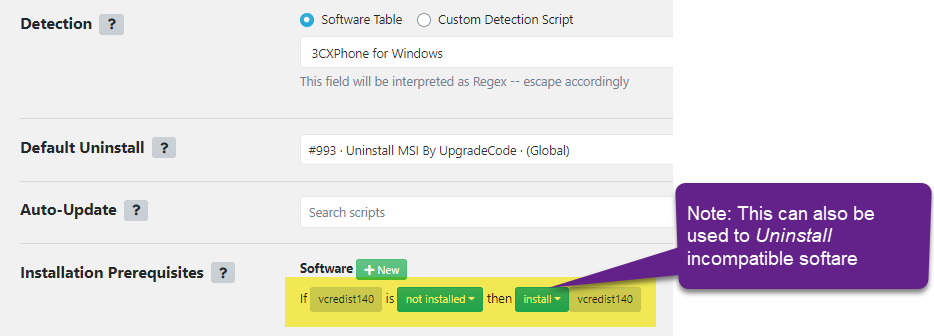
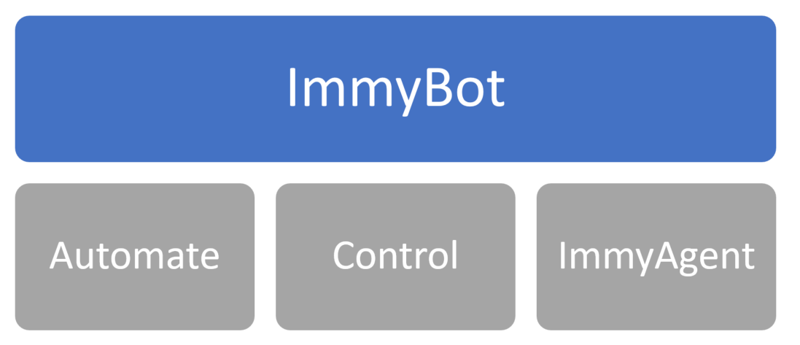
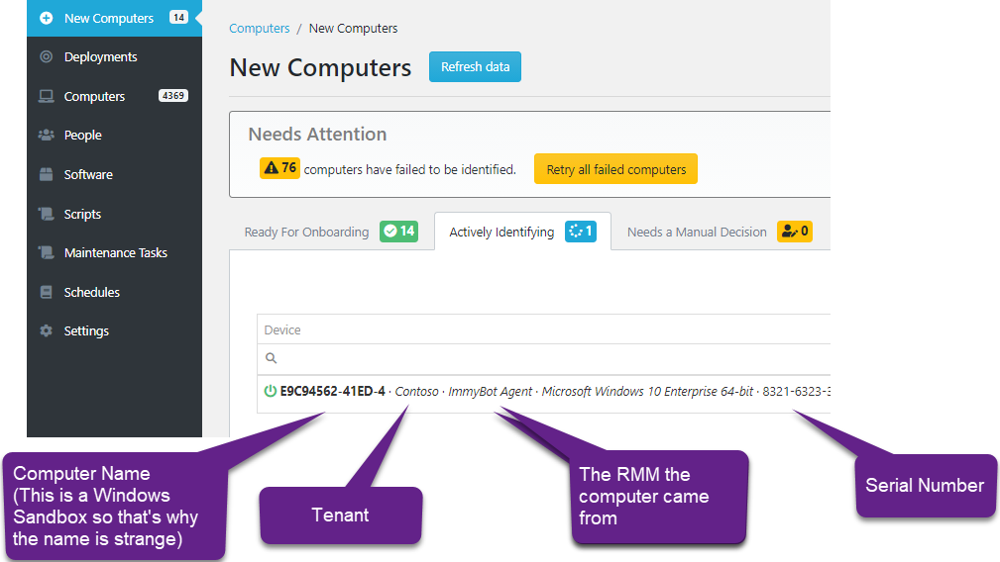
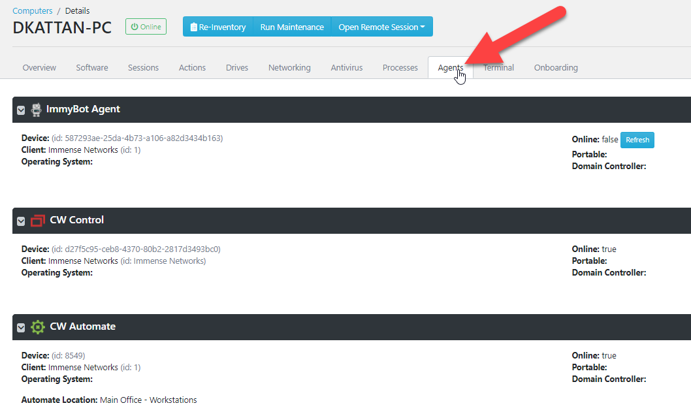

# Getting Started

## Preface
ImmyBot is a desired-state enforcement tool.

The goal of ImmyBot is to setup a computer knowing only the customer and the end user.
```mermaid
graph LR
subgraph Input
    User["End User (Optional)"]
    Customer[Customer]
end
User --> Magic --> F
subgraph Output
    Customer --> User
    F[Perfectly Setup Computer]
end
```
### Thinking with Immy
Thinking with Immy means thinking in terms of how things "Should" be.

You teach Immy how things "should" be by creating Deployments.

```mermaid
graph LR
subgraph "Deployment"
    Input["Software or Task"] -->|"Should Be"| DesiredState["Desired State"] -->|on| Group["One or More Computers"]
end
```
```mermaid
graph LR
subgraph "Adobe Reader"
    Input1["Adobe Reader"] -->|"Should Be"| DesiredState1["Installed"] -->|on| Group1["All Workstations and Portable Devices"]
end
```

How things "Should" be is often dependent on external factors. For example

- Customer A should have SentinelOne because they pay for it
- Person A should have Visio 365 because he has a license for it

Luckily, deployments can be conditionally applied based on the result of scripts that reach out to external sources

```mermaid
graph LR
subgraph "Should Deployment Apply?"
    Input --> Metascript
    Metascript --> True
    Metascript --> False
end
```

```mermaid
graph LR
subgraph "Should Visio Install?"
    EndUser["Input: End User"] --> Script["Graph API Script: Does End User have Visio License?"]
    Script --> True1[True]
    Script --> False1[False]
end
```

This is out of the box functionality in ImmyBot. I'm just showing you how it works to illustrate the power of the rules engine.

## Overview
ImmyBot deploys 2 things:
1. Software
1. Tasks

Tasks are for anything that isn’t software, think Bitlocker, Power Options, etc.

- You can use Tasks to configure software  by selecting a "Configuration Task" for the software
- Configuration Tasks are useful for configuring the application (even if the application wasn't installed by ImmyBot)
- Configuration Tasks run after Immy determines the software is installed
- Configuration Task parameters are available in all scripts related to the software

ImmyBot tests everything it does before and after it does it.
- Software
   - Version Detection - Runs before install to determine if installation is necessary, and after to verify the desired version is installed
     - DisplayName
       - Contains
       - Regex
       - Traditional (Wildcard \*)
     - UpgradeCode (For MSI based installs)
     - Script
       - Must return a version or null
   - Test Script - If software is installed, the failure of this test (the test script returning $false) will trigger a "Repair" action (default Uninstall/Install) of the application
      - Example: Check to verify Foxit PDF Editor is the Preview handler extension is working in Windows Explorer, reinstalling the PDF Editor usually corrects this scenario
- Tasks
  - Test script (When using separate scripts)
  - Combined script returns $false when $method is 'test'

### Example: Adobe Reader
We find that most MSPs install Adobe Reader by default so ImmyBot includes a Recommended Deployment that states
- "the latest version of Adobe Reader should be installed for all Workstations and Portable Devices"

When this rule applies (i.e. it isn't disabled or overridden by a more specific rule) ImmyBot will do the following:
1. Find the latest available version of Adobe Reader by running the Adobe Reader "dynamic version" script that uses a public API to return the latest full version number of Adobe Reader, as well as the URL to download it, the latest patch version of Adobe Reader, and the URL to download it.
2. Determine the installed version (if any) by looking for Adobe Reader in Add/Remove Programs on the machine
3. Queue an Install or Upgrade task (depending on the previous step)
4. Set Adobe Reader to be the default PDF handler by running the "configuration task" that verifies that Reader is the default handler for .PDF files for each user on the machine.

## Create your trial instance

If you don't already have an ImmyBot instance, sign-up for a trial at [https://www.immy.bot/pricing](https://www.immy.bot/pricing)

**Make sure you use a valid Office 365 Email address otherwise you will not be able to login as we require SSO to Azure AD. You're welcome**

You will receive a welcome email, click Setup ImmyBot:


Do something else for 6 minutes. Or 9 minutes if you are in Australia. It takes longer there for some reason.

You’ll receive this email when your instance is ready:


## Testing with Windows Sandbox

Windows Sandbox is a fast loading disposable container in Windows that loses all settings when shutdown or restarted. It is very convenient for testing software deployments. It should be noted that not all software is compatible with Windows Sandbox, particular software that installs drivers or requires restarts.

If you haven't used Windows Sandbox before, you can enable it by opening Windows PowerShell as Admin and running the following command:

```powershell
Enable-WindowsOptionalFeature -FeatureName "Containers-DisposableClientVM" -All -Online -NoRestart
```

#### Download Windows Sandbox file (.wsb)


Wait for ImmyBot Agent to install


[Onboard](#onboarding) the Sandbox




This will create an "Onboarding" Session (sessions are like running gpupdate) that will apply all applicable Deployments (deployments are like Group Policies)

## Adding Users

### Access Request
Have the person attempt to login to ImmyBot. Have them request access:


Approve that access from a yellow indicator at the top of the screen.


### Manual

If you haven't consented to allow Immy to read your AzureAD, you'll need to know the users' Object ID:


Second, Make the Person a user


(Optional) Make that User an Admin.


## Terminology
### Tenants

These are your Customers. We recommend syncing Tenants from CW Automate or Azure.

### User Computer Affinity
ImmyBot periodically runs whoami /upn on all computers and keeps a rolling list of the last 10 UPNs. It assigns the Primary User of the computer to the "Person" (Synced from Azure) with the matching UPN.

For environments without AzureAD, ImmyBot will lookup the UPN of the Person from a Domain Controller in the computer's Tenant

### Deployment

Deployments were originally called "Assignments" and are still called Assignments under the hood.

Note: You won't see the word "Assignment" in the user interface anywhere, but we plan to re-rename "Deployment" back to "Assignment" it in a future release.

A deployment is a rule that assigns [Software](#software) or [Tasks](#task) (Collectively known as "Maintenance Items") to a [Target](#target).



Deployments are conceptually similar to Group Policies in that they assign settings to a group of users or computers.

DO NOT BE AFRAID TO SAVE YOUR DEPLOYMENTS. THEY DO NOT APPLY AUTOMATICALLY.

If you DO want your Deployments to be applied automatically, you need to create a [Schedule](#schedules).

## Deployment Resolution

Also known as

* Creating Exceptions
* "Winning" Deployments
* Dealing with Snowflakes


Like Group Policies have a "Winning Policy", ImmyBot must have a "Winning Deployment" for a given Maintenance Item on a computer.

Let's say you have a customer "Contoso" that uses Adobe Acrobat instead of Adobe Reader, and you would like that to be installed instead.

First, create a Deployment that sets the desired state of Adobe Reader to Uninstalled for Contoso



Then, create a Deployment that Installs Adobe Acrobat for their computers



### [Target](#target)
A "[Target](#target)" is a grouping of computers (or Tenants in the case of "Cloud Tasks")

ImmyBot's ability to resolve [Targets](#target) to a group of computers is perhaps its most powerful feature.

For example, you can select a Group of users from AzureAD (which includes on-prem synced groups, and Teams) and ImmyBot will automatically resolve that to the list of computers in use by the people in that group.

If you enable PSA integration, a [Target](#target) could be all computers covered under a certain type of Agreement, or computers covered by an Agreement that includes a certain product.

This is particularly useful for security software, help desk portals, or anything else in your stack that you may only want to be installed for customers that are paying you for it.

Conversely, you could use this feature remove your stack for customers you are offboarding. Simply create an "Offboarding" product in your PSA, and create a deployment for each of the pieces of software you would like removed setting the desired state to Uninstalled for all customers with the "Offboarding" product on their agreement. Note: ImmyBot even honors the date range on additions, making scheduled offboarding easier if say the customer wants your software removed on the last day of the month.

### [Maintenance Session](#maintenance-session)

A [Maintenance Session](#maintenance-session) is conceptually similar to running gpupdate /force

In other systems, different types of maintenance happen on their own schedule. Windows Updates may run on Tuesday night, but Third Party updates may run on Wednesday night, and auto-fix tasks may run whenever an alert is fired for a failed monitor, which has its own polling interval.

By forcing all automation to happen in a sequential set of actions we call a [Maintenance Session](#maintenance-session), we can deliver predictability not only as to _what_ changes will be made, but also _when_.

This also provides a cohesive mechanism for setting up a new computer. At best in traditional RMMs you can assign Monitors that detect the absence of required software and run Install scripts when they are missing, but this doesn't scale as pre-requisites and exclusions are required.

Imagine if Group Policy could reliably deploy any type of software, and gpupdate /force worked reliably off-net, and when you ran it, it gave you real-time feedback about exactly what it was doing. Also imagine that it could optionally notify the end user before and after with a branded email telling them exactly what is being done, that optionally lets them cancel.

That's a [Maintenance Session](#maintenance-session).

You can view [Maintenance Sessions](#maintenance-session) for all computers under Computers->Sessions



Or, you can view [Maintenance Sessions](#maintenance-session) for a specific Computer under the Sessions tab for that Computer


### [Maintenance Session](#maintenance-session) Stages

#### Detection Stage

During the Detection Stage, ImmyBot "Detects" which Maintenance Actions are necessary to bring the computer into compliance. These Actions are added to the [Maintenance Session](#maintenance-session).

This is a read-only process, and typically done while the user is active. This is so ImmyBot can notify the user of changes that will occur later during the Execution Stage. By doing this during the day, and scheduling Execution for later, we are giving the end user the best possible chance to be aware of the upcoming maintenance, Postponing if you allow. The Postpone feature is very popular among engineers that do may need to leave renderings and analysis tasks running overnight.

#### Execution Stage


### [Maintenance Action](#maintenance-action)

```mermaid
flowchart TD
 SoftwareInstall --> Detect{Software Installed?}
 Detect --> |No| Install
 Detect --> |Yes| HasConfigurationTask{Has Configuration Task?}
 Install --> PostInstallDetect{Software Installed?}
 PostInstallDetect --> |Yes|HasConfigurationTask
 HasConfigurationTask --> |Yes| MaintenanceTaskTest{Run Test Script}
 MaintenanceTaskTest --> |return $true| Compliant
 MaintenanceTaskTest --> |return $false| RunSetScript(Run Set Script)
 RunSetScript --> PostMaintenanceTaskTest{Run Test Script}
 PostMaintenanceTaskTest --> |return $true| Compliant
 PostMaintenanceTaskTest --> |return $false| Non-Compliant
 PostInstallDetect --> |No| Non-Compliant
```

A *[Maintenance Session](#maintenance-session)* has one or more *[Maintenance Actions](#maintenance-action)*. A [Maintenance Action](#maintenance-action) could be to install software, apply a Windows Update, or run a [Task](#task).

The image below depicts a typical [Maintenance Session](#maintenance-session) with many [Maintenance Actions](#maintenance-action)



### Software
Software, in the context of ImmyBot refers to Software objects in My Software or Global Software.

My Software - Initially empty. When you upload your own software to ImmyBot, it goes into My Software

Global Software - Read-Only, managed by the ImmyBot team.

At the bare minimum, Software requires a [Detection Method](#detection-method).
Software can have many [Software Versions](#software-version).

```mermaid
graph TD
    C[Software] --> D[Custom Detection Script]
    C -->E[Default Uninstall Script]
    C --> F[Auto-Update Script]
```


#### Pre-Requisities
This is a VERY powerful, and critically underrated feature in ImmyBot. ImmyBot resolves dependencies recursively, with built-in circular reference detection.

Common uses for Pre-Requisites include
* Ensuring a piece of software is installed before installing another
  * C++ Redistributables before 3CX Client
  * Office is installed before an Outlook Add-in
* Ensuring a piece of software is _uninstalled_ before install another
  * Removing Adobe Acrobat Reader before installing Adobe Acrobat Professional

#### Install required dependencies



#### Ordering [Maintenance Actions](#maintenance-action)


### Detection Method
A Detection Method is required in order to know whether or not a piece of Software is installed on a machine.

For Software, the detection method must returns the version of the software installed on the machine, if any.

For [Tasks](#task), the Detection Method is the "test" mechanism, which must return true or false to indicate whether or not the machine is in compliance.

### Software Version
```mermaid
graph TD
    C[Software Version] --> Install
    C --> Uninstall
    C --> Upgrade
    C --> Repair
    C --> Test
```

### Task
A Task (aka Mainenance Task) is a catch-all for anything that isn't software.

```mermaid
graph TD
    C[Task]
    C --> Get
    C --> Set
    C --> Test
```

or

```mermaid
graph TD
    C[Task]
    C --> S[Combined Script with $method parameter containing 'get','set', or 'test']
```

### Task Modes

#### Enforce
Runs the "test" script, if the test returns false, runs "set", then runs "test" again to verify.

#### Audit
Runs the "test" script which should return true or false. It can output whatever it wants, but the last output should be boolean.

#### Monitor
Runs the "get" script, which can return anything. Useful for collecting data like Bitlocker Keys, Quickbooks Licenses, or any other piece of information you are interested in.

### Scripts
From the above diagrams, you can see that scripts are the building blocks for higher level objects like Software and Tasks.

### Execution Context
#### System
Run as a service on the machine

#### User
Will attempt to run as the logged on user

#### Metascript
Runs in the ImmyBot backend, and can spawn code on the system by using Invoke-ImmyCommand

#### Cloud Script
Runs in the ImmyBot backend, but intended to be run against a Tenant (perhaps for the purpose of getting or setting some setting in 365/Azure or some other system with an API). These are used exclusively in [Tasks](#task) targetting "Tenants".


### Schedules
Used to run maintenance periodically on machines. Can optionally be limited to a single Maintenance Item.

NOTE You must also have a Deployment for the Maintenance Item to set the desired state. Imagine a scenario where you need to ensure a single piece of software is up-to-date on all computers except for a CNC machine. Create 2 deployments, the first setting the desired state to Installed->Latest for all computers, then a second stating that the desired state is Ignored for the CNC machine. When you create the schedule, the software will be ignored for the CNC machine.

### Integrations

To ImmyBot, an RMM is a system that provides a list of computers, and a mechanism to run PowerShell scripts on them.



To avoid having to deploy the ImmyAgent to existing machines, ImmyBot optionally integrates with RMMs like ConnectWise Automate and ConnectWise Control and uses their agents instead. These systems are not as performant as the ImmyAgent, but can suppliment ImmyBot functionality.

For example, if you add an RMM Link for ConnectWise Control, you can open a remote session to the computer directly within ImmyBot:


If you add an RMM integration for ConnectWise Automate, Scheduled [Maintenance Sessions](#maintenance-session) will apply all Approved Windows Updates using the ConnectWise Automate API based on your Approval Policies in Automate Patch Manager.

You can even add multiple RMMs of the same type, which is often useful in merger and acquisition scenarios. You may choose to use ImmyBot as your single pane of glass to manage both, or simply let ImmyBot be a neutral third party for facilitating the consolidation of RMM agents to the parent company's RMM.

### Identification

Because the same computer often exists in multiple RMMs (Like how CW Automate typically installs CW Control Automatically), ImmyBot prevents duplicates by identifying the computer by a unique id. We DO NOT use MAC Address! This unique id persists even if you wipe and reload the machine.

When a new machine is detected, it first goes to New Computers->Actively Identifying


It uses the following script to collect the UUID from the machine:
```
gwmi Win32_ComputerSystemProduct | select -expand UUID
```

This value is static even if you wipe and reload the machine, although we have **VERY** rarely seen this value change following a BIOS upgrade or due to a mainboard fault. We chose this value instead of Mac Address or Hard Drive serial number because of issues other systems have with USB Ethernet cables and hard drive replacement. We did not use serialnumber because we learned that many computers do not have serial numbers.

In practice, this value works almost _too_ well. Machines you just wiped and expect to find in New Computers, are often associated to their pre-wiped computer objects. To find them, you often have to search for the serial number of the computer in the Computer List. In 0.40.1 we began using the Windows OfflineInstallationID value to identify when an existing computer has been wiped so we can set its status to "Needs Onboarding" which causes it to show up under New Computers as expected.

If it is a machine ImmyBot has seen before, it will be associated to the existing Computer, and you will find a new entry under the Computer's Agents tab. Under the hood we call these entries "RmmComputers".

Computers can have one or more RmmComputers(Agents). You can think of these as logical "pathways" to the computer. We only need one to be online to function.



## Identification Failures

### Needs a Manual Decision
Generally you will click "Agent Re-installed"

Often when an RMM Agent gets re-installed, it will get a new id in the RMM (ComputerId in Automate, SessionID in Control). ImmyBot will recognize that it is the same computer, but due to the fact that virtualization technologies and hard drive cloning can lead to the same scenario, we require you to tell us whether we should overwrite the existing RmmComputer, or keep both. 99% of the time you will click "Overwrite Existing". If the machine was in fact cloned, you would click Keep Both, in which case Immy shims the duplicate UUID with its own to prevent collisions.

## Pending Computers
Computers in the pending status have yet to be identified.

Computers may get stuck here if we are unable to run our Ephemeral Agent

```mermaid
graph TD
    CheckImmyAgentLogs[Check ImmyAgent Logs in C:\ProgramData\ImmyBot\Logs] --> DidEphemeralAgentStart[Immybot.Agent.Ephemeral.exe start?]
    DidEphemeralAgentStart --> |Yes|CheckEphemeralAgentLogs[Check Ephemeral Agent logs in C:\ProgramData\ImmyBot\Scripts\*\*.log]
    DidEphemeralAgentStart --> |No|BlockedBySecuritySoftware[Exclude Script Path from Security Software]
    CheckEphemeralAgentLogs --> EphemeralAgentConnect[Did Ephemeral Agent Websocket Connect?]
    EphemeralAgentConnect -->|Yes|DidSuccessfullyIdentifyAfterFix
    EphemeralAgentConnect --> |No|TryNoSSLInspect[Put on network without SSL Inspection]
    TryNoSSLInspect --> DidSuccessfullyIdentifyAfterFix[Ephemeral Agent Connect After Fix?]
    DidSuccessfullyIdentifyAfterFix[Machine Identify Successfully?] --> |No|EmailSupport
    DidSuccessfullyIdentifyAfterFix[Machine Identify Successfully?] --> |Yes|Done
    EmailSupport["Email logs from C:\ProgramData\ImmyBot\Logs and C:\ProgramData\ImmyBot\Scripts\*\*.logs to support@immy.bot"]
```

Top 3 reasons for Identification Failures
1. SSL Inspection blocking our websocket
1. Security Software blocking PowerShell
1. Incorrect time is preventing SSL/TLS connection

To understand the various reasons identification can fail, it helps to understand how ImmyBot executions PowerShell
1. RMM or ImmyAgent runs Immybot.Agent.Ephemeral.exe
1. Immybot.Agent.Ephemeral.exe establishes a secure websocket to wss://subdomain.immy.bot and runs Invoke-PSPipeHost.ps1
1. Immybot.Agent.Ephemeral.exe feeds Invoke-PSPipeHost.ps1 PowerShell over a pipe from the websocket session

```mermaid
graph LR
    ImmyBot --> |Parallel|Automate[Run script to download and run Ephemeral Agent via Automate]
    ImmyBot --> |Parallel|Control[Run script to download and run Ephemeral Agent via Control]
    ImmyBot --> |Parallel|ImmyAgent[Run script to download and run Ephemeral Agent via ImmyAgent]
    ImmyBot --> |Parallel|N-Central[Run script to download and run Ephemeral Agent via N-Central]
    Automate --> Immybot.Agent.Ephemeral.exe
    Control --> Immybot.Agent.Ephemeral.exe
    ImmyAgent --> Immybot.Agent.Ephemeral.exe
    N-Central --> Immybot.Agent.Ephemeral.exe
    Immybot.Agent.Ephemeral.exe --> cmd.exe --> powershell.exe --> Invoke-PSPipeHost.ps1
```

The most common cause of identification failure is security software.

To know if this is the case, pull the logs from C:\ProgramData\ImmyBotAgentService\*.log


Normal Immybot Agent logs look like this:
```
2022-06-14 00:02:25.560 -05:00 [DBG] Hosting starting
2022-06-14 00:02:25.799 -05:00 [INF] Starting Immybot Agent
2022-06-14 00:02:25.943 -05:00 [INF] Using configuration file stored at: C:\ProgramData\ImmyBotAgentService\config.json
2022-06-14 00:02:26.875 -05:00 [DBG] Initializing IoT Hub connection
2022-06-14 00:02:35.023 -05:00 [INF] Application started. Hosting environment: Production; Content root path: C:\WINDOWS\TEMP\.net\Immybot.Agent.Service\lreaszzz.wwx\
2022-06-14 00:02:35.024 -05:00 [DBG] Hosting started
2022-06-14 00:02:40.552 -05:00 [WRN] IoT Hub connection status Changed Status => [Connected] Reason => [Connection_Ok]
2022-06-14 02:06:32.159 -05:00 [DBG] Process started; ID: 12724
2022-06-14 02:06:37.358 -05:00 [DBG] Running C:\ProgramData\ImmyBot\Scripts\840290f2bd2142e2bd2c612542436763\Immybot.Agent.Ephemeral.exe --ImmyScriptPath C:\ProgramData\ImmyBot\Scripts\840290f2bd2142e2bd2c612542436763 --BackendAddress wss://immense.immy.bot/ --SessionID c946e1d1-f5fd-d36d-0489-d2a9ad9084e0
2022-06-14 02:06:38.335 -05:00 [DBG] PID 16184 <----- Indicates successful execution
2022-06-14 02:06:38.372 -05:00 [DBG] Process exited; Code: 0
```

Windows Defender will make the logs look like this:
```
2022-11-17 13:13:36.604 +11:00 [DBG] Hosting starting
2022-11-17 13:13:36.817 +11:00 [INF] Starting Immybot Agent
2022-11-17 13:13:36.840 +11:00 [INF] Using configuration file stored at: C:\ProgramData\ImmyBotAgentService\config.json
2022-11-17 13:13:37.590 +11:00 [DBG] Initializing IoT Hub connection
2022-11-17 13:13:37.860 +11:00 [DBG] Hosting started
2022-11-17 13:13:38.598 +11:00 [WRN] IoT Hub connection status Changed Status => [Connected] Reason => [Connection_Ok]
2022-11-17 13:13:39.157 +11:00 [WRN] Dirty-Shutdown detected! Dirty-File created at: "2022-11-07T04:11:59.3975026Z" UTC
2022-11-17 13:13:41.686 +11:00 [DBG] Process started; ID: 5660
2022-11-17 13:13:44.674 +11:00 [DBG] Running C:\ProgramData\ImmyBot\Scripts\4303da9b790b41c6978b50b872fe17cb\Immybot.Agent.Ephemeral.exe --ImmyScriptPath C:\ProgramData\ImmyBot\Scripts\4303da9b790b41c6978b50b872fe17cb --BackendAddress wss://ericom.immy.bot/ --SessionID a92c0ed1-ea3b-7f8a-d9c6-946d9b44ccc5
2022-11-17 13:13:49.577 +11:00 [DBG] WMI Error 2
```
DNS Filtering/Issues make the logs look like this
```
2022-09-20 20:39:59.712 +10:00 [INF] RESPONSE: {
  "Resource": "installer/challenge/request",
  "Method": "POST",
  "StatusCode": 0,
  "ErrorException": {
    "ClassName": "System.Net.WebException",
    "Message": "No such host is known. (XXXX.immy.bot:443)"
```
To correct it, you need to exclude DNS filtering for your instances hostnames, which are found under
	Show more > integrations > Fetch IP Address and Hostnames

If Powershell is failing to start on the endpoint within 60 seconds a timeout will occur.

Here is a suggestion on a cause and possible fix for that one https://www.reddit.com/r/PowerShell/comments/rx68fw/powershell_slow_to_open_long_load_timesfixed
 
## Security Software Exclusions
Ideally you would instruct your security software would support excluding code signed by

```
CN=Immense Networks LLC, O=Immense Networks, L=Baton Rouge, S=Louisiana, C=US
```

Exclusions based on code signing certificate are an industry standard feature and should be a standard feature in any best-in-class security software. However, if your security software is unable to exclude based on code signing certificate, create an exclusion for your instance's Script Path.

Your script path can be found under Settings->Preferences->Script Path


* [ThreatLocker](#threatlocker)
* [BitDefender](#bitdefender)
* [Microsoft Defender for Endpoint](#script-path-exclusion)
* [Deep Instinct](#script-path-exclusion)
* [CrowdStrike](#script-path-exclusion)
* [AlienVault](#script-path-exclusion)

### ThreatLocker

1.	Application Control-> Applications
2.	Create New Application
3.	Put the following value into Certificate and click Add
```
CN=Immense Networks LLC, O=Immense Networks, L=Baton Rouge, S=Louisiana, C=US
```
4.	Add your instance’s [script path](#script-path-exclusion)

Ultimately it should look like this:

5.	Create a New Application Policy
	

### BitDefender
BitDefender will intermittently block script execution unless you disable Aggressive scanning mode or add a your instance's [Script Path](#script-path-exclusion) to your policy's exclusion list.

### CrowdStrike
CrowdStrike uses AI to decide what to allow and disallow. Periodically this AI will mark the ImmyBot Agent or ImmyBot Ephemeral Agent as malicious. This usually happens after we update it. Marking it as a false positive in your CrowdStrike portal will train the global AI to not treat it as malicious.

### Microsoft Defender for Endpoint
Add a your instance's [Script Path](#script-path-exclusion) to your policy's exclusion list.
https://docs.microsoft.com/en-us/mem/intune/configuration/device-restrictions-configure#create-the-profile

### Cylance
Cylance blocks our websocket making the ImmybotAgent log look like this:
```
2022-09-21 12:24:26.562 -04:00 [INF] Process exiting.
2022-09-21 12:24:40.106 -04:00 [DBG] Closing Websocket...
2022-09-21 12:24:49.743 -04:00 [INF] Marked ConnectionState as disconnected.
2022-09-21 12:24:50.171 -04:00 [ERR] Application shutting down (App lifetime token cancelled)
System.IO.IOException: Cannot access a closed stream.
at System.Net.Http.HttpConnection.RawConnectionStream.WriteAsync(ReadOnlyMemory`1 buffer, CancellationToken cancellationToken)
```
To correct it, you need to bypass SSL Inspection for your instances hostnames/IPs, which are found under
	Show more > integrations > Fetch IP Address and Hostnames

 ### Group Policy Objects

Computer Configuration | Policies | Administrative Templates | Windows Components | Windows PowerShell | Turn on Script Execution (Enabled)

User Configuration | Policies | Administrative Templates | Windows Components | Windows PowerShell | Turn on Script Execution (Enabled)

These GPOs have been known to cause issues with running scripts.

